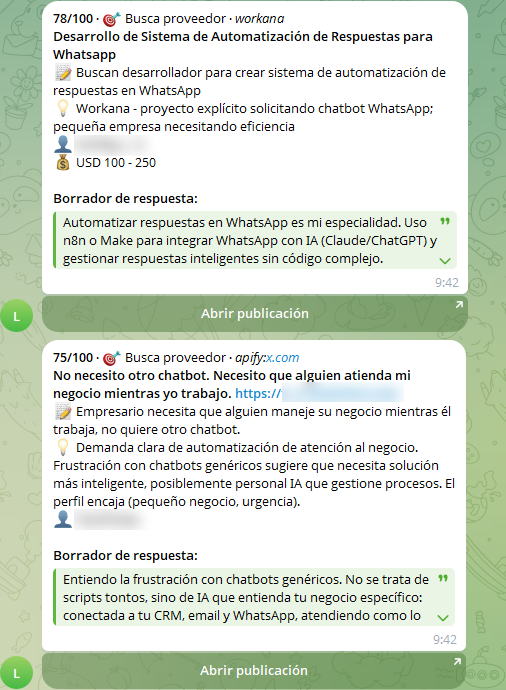

# 📡 LeadRadar

**Encuentra a gente que está pidiendo justo lo que tú vendes — en LinkedIn, X, Reddit, Workana, Freelancer.com, Hacker News, Bluesky y cualquier web que le indiques. La IA (Claude, ChatGPT o Gemini) lee cada publicación, puntúa la intención real de compra, te escribe un primer mensaje útil y te avisa por Telegram.**

> 🇬🇧 [Read in English](README.md) · 📘 **[Guía paso a paso con capturas](docs/GUIA.md)** — sin instalar nada

```
 fuentes ──► solo recientes ──► sin duplicados ──► Claude puntúa intención ──► Telegram / Discord / Slack
 (10 tipos)  (≤ 72 h)           (SQLite)            y redacta respuesta           + leads.html / leads.csv
```

- **Intención, no menciones.** Las herramientas de *social listening* te dicen que alguien escribió "n8n". LeadRadar te dice *"un hostal quiere un agente de reservas por WhatsApp y busca freelance — aquí tienes una respuesta"*. Los que ofrecen sus propios servicios se descartan.
- **Solo leads frescos.** Cada fuente se filtra por su fecha real de publicación (por defecto, últimas 72 h) — nada de ofertas de hace un mes.
- **Solo borradores, nunca envía nada solo.** Tú decides qué sale.
- **Sin baneos.** A LinkedIn, X y Reddit se llega con actores de Apify sin cookies — nunca con tu sesión.
- **Cualquier oficio.** `leadradar init --describe "SEO freelance para tiendas Shopify"` te escribe la configuración.
- **Elige tu IA.** Claude (por defecto), ChatGPT, Gemini o cualquier API compatible con OpenAI (OpenRouter, Groq, Ollama…).
- **Barato y sin servidor.** ~0,10 $ de IA por cada 100 publicaciones, gratis en GitHub Actions.

## Claves de API — las mínimas

| Clave | ¿Hace falta? | Para qué | Dónde se saca | Coste |
|---|---|---|---|---|
| **Una clave de IA:** `ANTHROPIC_API_KEY` *o* `OPENAI_API_KEY` *o* `GEMINI_API_KEY` | **Obligatoria** | Lee, puntúa y redacta (pon `scoring.provider` a juego) | [Claude](https://console.anthropic.com/settings/keys) · [OpenAI](https://platform.openai.com/api-keys) · [Gemini](https://aistudio.google.com/apikey) | ~0,10 $ por 100 publicaciones (Claude Haiku) |
| `TELEGRAM_BOT_TOKEN` + `TELEGRAM_CHAT_ID` | **Obligatoria** (o Discord/Slack) | Donde te llegan los leads | @BotFather en Telegram y luego `leadradar telegram-setup` | Gratis |
| `APIFY_API_TOKEN` | Recomendada | **LinkedIn + X + Reddit** con una sola clave, sin cookies | [apify.com](https://apify.com) → Settings → API & Integrations | Pago por resultado, con crédito gratis mensual; ~0,10–0,30 $ por pasada con los valores por defecto |
| `SERPER_API_KEY` | Opcional | Fuente `web`: Quora, Indie Hackers, foros vía Google | [serper.dev](https://serper.dev) | 2.500 búsquedas gratis |
| `DISCORD_WEBHOOK_URL` / `SLACK_WEBHOOK_URL` | Opcional | Otros canales de aviso | Ajustes del canal → Integraciones → Webhooks | Gratis |

Solo con las dos obligatorias ya tienes **Workana, Freelancer.com, Hacker News y Bluesky** (no necesitan clave). Añade Apify para LinkedIn, X y Reddit. Si no pones la clave de Apify, esa fuente se salta sola.

## Cómo se ve

Cada lead llega a Telegram como una tarjeta — puntuación, qué necesita, por qué encaja, presupuesto, borrador desplegable y botón "Abrir publicación":



…y en cada pasada se genera `output/leads.html`: una página con filtros y botón de "copiar borrador".

## Fuentes

| Fuente | Clave | Notas |
|---|---|---|
| `workana` | – | Proyectos de España y Latam (usa [Scrapling](https://github.com/D4Vinci/Scrapling) para pasar el muro anti-bots). Filtrado por "Hace N horas/días". |
| `freelancer` | – | Proyectos abiertos de Freelancer.com. |
| `hackernews` | – | API de Algolia. Posts y comentarios. |
| `bluesky` | – | Búsqueda pública, filtro por idioma. |
| `apify` | `APIFY_API_TOKEN` | Presets: **`linkedin`** (búsqueda de posts, sin cookies), **`x`** (búsqueda de tweets), **`reddit`** (búsqueda de posts). O cualquier otro actor de Apify con un mapeo de campos (Instagram, grupos de Facebook…). |
| `web` | `SERPER_API_KEY` | Búsquedas `site:` en Quora, Indie Hackers, foros… (también `ddgs` gratis sin clave, Brave, Exa). La fecha de los resultados de LinkedIn/X se saca de su id. |
| `rss` | – | Cualquier feed RSS/Atom: portales de empleo, Google Alerts, foros. |
| `scrape` | – | Cualquier página de listados con selectores CSS (incluye navegador sigiloso para Cloudflare). |
| `reddit` | – | RSS de Reddit sin clave. Muy limitado y bloqueado desde GitHub — mejor el preset `reddit` de Apify. |
| `agentreach` | tu sesión | Reddit + X con las herramientas de [Agent-Reach](https://github.com/Panniantong/Agent-Reach) (`rdt-cli`, `twitter-cli`), que reutilizan **tus cookies**. Va contra las normas de automatización de esas plataformas — cuenta secundaria, poco volumen y solo en local. Desactivada por defecto. |

Añadir una fuente es un archivo con una función `collect(conf, ctx) -> list[Item]` — mira `leadradar/sources/`.

## Sirve para cualquier oficio

No está atado a ningún nicho. Describe tu negocio en una frase y Claude escribe toda la configuración — frases de compradores para cada fuente, subreddits, filtros de ruido y tono de las respuestas:

```bash
leadradar init --describe "SEO freelance para negocios locales y tiendas Shopify en España y Latam"
leadradar init --describe "Email marketing con Klaviyo para tiendas online"
```

Ejemplos listos (generados exactamente así): [`examples/seo.yaml`](examples/seo.yaml), [`examples/email-marketing.yaml`](examples/email-marketing.yaml). En una prueba, la config de SEO encontró una gestoría de Madrid, un médico deportivo y una marca de cacao en Shopify buscando SEO.

## Empezar en tu ordenador

Necesitas Python 3.10+.

```bash
git clone https://github.com/iaquetrabaja/leadradar && cd leadradar
python -m venv .venv && source .venv/bin/activate   # Windows: .venv\Scripts\activate
pip install -e ".[stealth]"

leadradar init                                       # crea config.yaml + .env
# pon tus claves en .env y adapta la config a tu negocio:
leadradar init --force --describe "qué vendes y a quién"

leadradar run --no-llm       # gratis: ver qué encuentra cada fuente (--sources workana,apify para elegir)
leadradar run --dry-run      # puntúa con Claude y muestra los leads sin avisar
leadradar run                # en serio
```

### Telegram en 2 minutos

1. En Telegram, habla con **@BotFather** → `/newbot` → copia el token en `TELEGRAM_BOT_TOKEN`.
2. Abre tu bot nuevo y pulsa **Iniciar** (o mándale cualquier mensaje).
3. `leadradar telegram-setup` te muestra tu `TELEGRAM_CHAT_ID`. Pégalo en `.env`.
4. `leadradar test-notify` — te debería llegar una tarjeta de prueba.

(¿Lo quieres en un grupo con tu equipo? Añade el bot al grupo, escribe algo allí y vuelve a ejecutar `telegram-setup`.)

## Ejecutarlo en GitHub Actions (gratis, sin servidor)

1. Pulsa **Use this template → Create a new repository** y hazlo **privado**. (Tu config describe tu negocio y los artefactos de cada pasada contienen los leads — en un repo público cualquiera puede descargarlos.)
2. Copia `config.example.yaml` a `config.yaml` (o genérala con `init --describe`), edítala y haz commit.
3. **Settings → Secrets and variables → Actions → New repository secret**: añade `ANTHROPIC_API_KEY`, `TELEGRAM_BOT_TOKEN`, `TELEGRAM_CHAT_ID` y `APIFY_API_TOKEN` si lo usas.
4. Pestaña **Actions** → **LeadRadar** → **Run workflow** para probarlo una vez.

A partir de ahí se ejecuta según el horario de `.github/workflows/leadradar.yml` (3 veces al día por defecto — una vez al día suele bastar y cuesta un tercio). La base de datos de "ya visto" se guarda en la caché de Actions, así nunca recibes el mismo lead dos veces, y cada pasada sube `leads.html` como artefacto.

## Configuración

Todo está en `config.yaml` — el [ejemplo](config.example.yaml) está comentado línea a línea. Lo más importante:

- **`profile.offer` / `ideal_client` / `not_a_fit`** — Claude puntúa cada publicación contra esto. Sé concreto.
- **`queries`** — frases que escriben de verdad tus clientes (*"busco a alguien que automatice"*, *"recomendáis alguna agencia de IA"*). Las APIs por palabra clave (Bluesky, HN, Workana…) funcionan mejor con sus propias `queries` cortas; Claude filtra la intención después.
- **`max_age_hours`** — 72 por defecto. Pon 24 si lo ejecutas a diario y solo quieres lo de hoy.
- **`notify.min_score`** — 60 por defecto. Las reglas fijas limitan a los vendedores a 30 y la charla sobre el tema a 55, así que todo lo ≥ 60 es un comprador pidiendo ayuda explícitamente; súbelo a 75–85 para solo lo más caliente.
- **`scoring.provider`** — `anthropic` (por defecto), `openai`, `gemini` u `openai_compatible` (+ `base_url`). Mira [la guía](docs/GUIA.md#10-cambiar-de-ia).
- **`scoring.model`** — vacío = el modelo barato de cada proveedor (`claude-haiku-4-5`, `gpt-5-mini`, `gemini-3.8-flash`). Claude Haiku: medido en **~0,09 $ por 100 publicaciones**. `claude-sonnet-5-5` o `claude-opus-5-5` escriben borradores más finos por unas 3–4 veces más. `max_items_per_run` limita el gasto, y cada pasada muestra tokens y coste estimado.

Si existe `config.local.yaml` (ignorado por git) tiene prioridad sobre `config.yaml` — útil para pruebas en local.

## Cómo puntúa

Las publicaciones van a la IA por lotes con tu oferta en el prompt de sistema. El modelo devuelve JSON estructurado por publicación (validado con Pydantic): si el autor es **comprador o vendedor** y si **pide ayuda explícitamente** (los vendedores se limitan a 30 y la charla sobre el tema a 55, así que nunca se avisan), `score` (0–100), `intent` (busca proveedor / herramienta / pregunta cómo / frustrado / oferta de trabajo), un resumen y un motivo de una línea en tu idioma, y — si es lead — un borrador **en el idioma de la publicación** que empieza aportando algo útil en vez de vender. El contenido de las publicaciones se trata como datos no fiables (se ignoran instrucciones escritas dentro).

## Úsalo con cabeza

- **No hagas spam.** LeadRadar nunca escribe a nadie; responder es cosa tuya. Contesta en público donde preguntaron, o escribe en privado de forma breve y personal.
- **Las normas de email/DM en frío dependen del país** (RGPD + LSSI en España, CAN-SPAM en EE. UU.…). Conoce las tuyas.
- **Respeta los términos de cada web.** Usa APIs oficiales y claves cuando existan, mantén volúmenes bajos (los valores por defecto son prudentes) y no scrapees detrás de un login.

## Proyectos relacionados

LeadRadar toma ideas de [LeadEcho](https://github.com/rohansx/leadecho), [OpenOutreach](https://github.com/eracle/OpenOutreach) y [upwork-job-alerts](https://github.com/janglewood/upwork-job-alerts), y usa [Scrapling](https://github.com/D4Vinci/Scrapling) para las webs difíciles.

## Licencia

MIT
