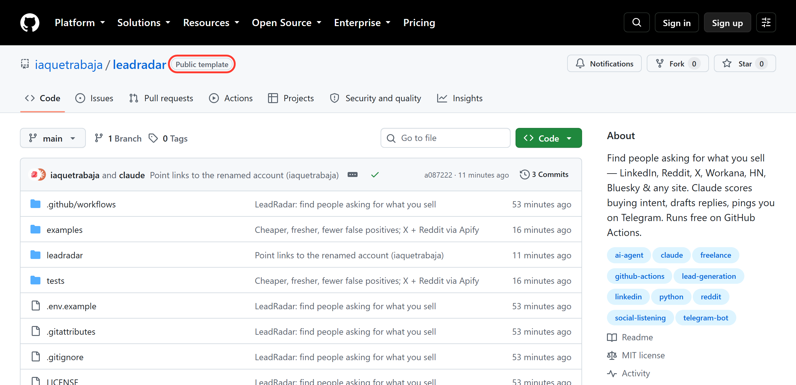
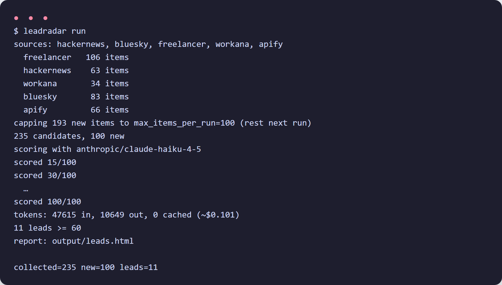
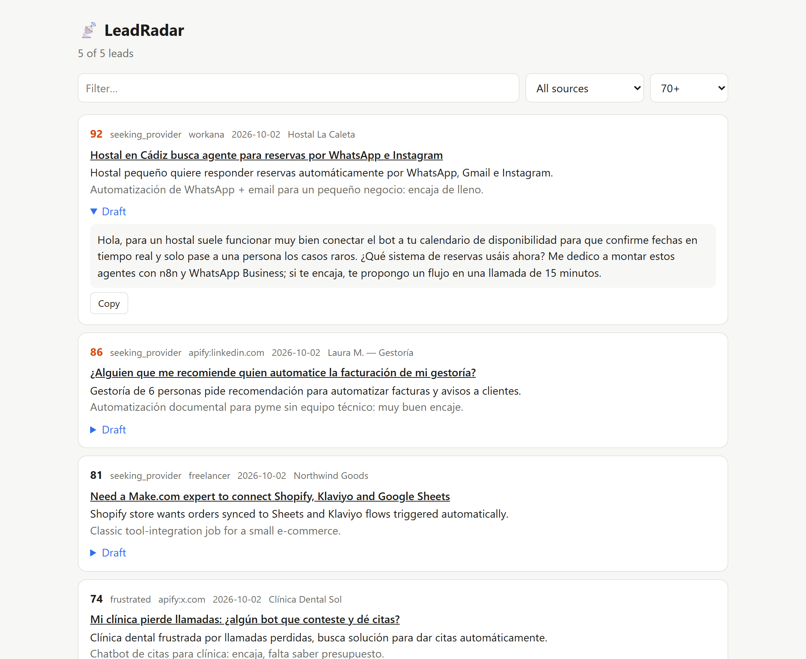

# Guía paso a paso — LeadRadar sin instalar nada

> 🇬🇧 [English version](GUIDE.md) · ⬅ [Volver al README](../README.es.md)

En unos 15 minutos tendrás un "radar" que **cada mañana busca a gente pidiendo lo que tú vendes** (en Workana, Freelancer, LinkedIn, X, Reddit, Hacker News y Bluesky), descarta a los que solo venden o comentan, y **te manda a Telegram** cada oportunidad con un borrador de respuesta.

Todo se hace desde el navegador: no necesitas instalar Python ni tener un servidor. Se ejecuta gratis en GitHub Actions.

**Índice**
1. [Qué necesitas](#1-qué-necesitas)
2. [Copia la plantilla](#2-copia-la-plantilla)
3. [Consigue una clave de IA (Claude, ChatGPT o Gemini)](#3-consigue-una-clave-de-ia)
4. [Crea tu bot de Telegram](#4-crea-tu-bot-de-telegram)
5. [(Opcional) Apify para LinkedIn, X y Reddit](#5-opcional-apify-para-linkedin-x-y-reddit)
6. [Configura qué vendes y qué buscar](#6-configura-qué-vendes-y-qué-buscar)
7. [Guarda las claves como secretos](#7-guarda-las-claves-como-secretos)
8. [Lánzalo y mira el resultado](#8-lánzalo-y-mira-el-resultado)
9. [Opciones más útiles](#9-opciones-más-útiles)
10. [Cambiar de IA](#10-cambiar-de-ia)
11. [Cuánto cuesta](#11-cuánto-cuesta)
12. [Problemas frecuentes](#12-problemas-frecuentes)
13. [Usarlo en tu ordenador (avanzado)](#13-usarlo-en-tu-ordenador-avanzado)

---

## 1. Qué necesitas

| | ¿Obligatorio? | Coste |
|---|---|---|
| Cuenta de GitHub | Sí | Gratis |
| **Una** clave de IA: Claude, ChatGPT **o** Gemini | Sí | Céntimos por pasada |
| Telegram en el móvil | Sí (o Discord/Slack) | Gratis |
| Cuenta de Apify | No — añade LinkedIn, X y Reddit | Pago por resultado, con crédito gratis mensual |

Solo con lo obligatorio ya busca en **Workana, Freelancer.com, Hacker News y Bluesky**.

## 2. Copia la plantilla

1. Entra en GitHub con tu cuenta y abre **https://github.com/iaquetrabaja/leadradar**.
2. Pulsa el botón verde **Use this template → Create a new repository**.
3. Ponle un nombre (por ejemplo `mi-leadradar`) y marca **Private**. Es importante: tu configuración describe tu negocio y los informes contienen los leads.
4. Pulsa **Create repository**.



> ¿No ves el botón? Asegúrate de haber iniciado sesión en GitHub — a los visitantes sin sesión no se les muestra.

## 3. Consigue una clave de IA

Elige **una** de estas tres. Las tres funcionan igual de bien para esto; la diferencia es sobre todo el precio y dónde tienes cuenta.

| IA | Dónde sacar la clave | Nombre del secreto | Modelo por defecto |
|---|---|---|---|
| **Claude** (recomendado) | [console.anthropic.com/settings/keys](https://console.anthropic.com/settings/keys) → *Create Key* | `ANTHROPIC_API_KEY` | `claude-haiku-4-5` |
| **ChatGPT** (OpenAI) | [platform.openai.com/api-keys](https://platform.openai.com/api-keys) → *Create new secret key* | `OPENAI_API_KEY` | `gpt-5-mini` |
| **Gemini** (Google) | [aistudio.google.com/apikey](https://aistudio.google.com/apikey) → *Create API key* | `GEMINI_API_KEY` | `gemini-3.8-flash` |

Copia la clave y guárdala un momento en un sitio seguro: solo se muestra una vez. En los tres casos hay que tener saldo o facturación activada en la cuenta de API (es distinta de la suscripción de ChatGPT Plus / Claude Pro). Gemini suele ofrecer un nivel gratuito con límites de uso.

## 4. Crea tu bot de Telegram

1. En Telegram, busca **@BotFather** y escríbele `/newbot`.
2. Elige un nombre y un usuario que acabe en `bot` (por ejemplo `MisLeadsBot`).
3. BotFather te da un **token** parecido a `8123456789:AAH...`. Ese es tu `TELEGRAM_BOT_TOKEN`.
4. Abre tu bot nuevo (el enlace `t.me/...` que te da BotFather) y pulsa **Iniciar**.
5. Para saber tu `TELEGRAM_CHAT_ID`, abre en el navegador esta dirección cambiando `TU_TOKEN` por el token del paso 3:

   ```
   https://api.telegram.org/botTU_TOKEN/getUpdates
   ```

   Verás un texto con `"chat":{"id":123456789,...`. Ese número es tu `TELEGRAM_CHAT_ID`. (Si sale vacío, vuelve a escribirle algo al bot y recarga.)

> ¿Lo quieres en un grupo con tu equipo? Añade el bot al grupo, escribe algo en el grupo y repite el paso 5: el id del grupo empieza por `-`.

> 🔒 Trata el token como una contraseña. Si lo compartes sin querer, en BotFather escribe `/revoke` para generar uno nuevo.

## 5. (Opcional) Apify para LinkedIn, X y Reddit

Estas tres redes no dejan buscar sin cuenta, y usar tu propia cuenta arriesga un bloqueo. Apify lo hace por ti con "actores" que no necesitan tu login.

1. Crea una cuenta en [apify.com](https://apify.com).
2. Ve a **Settings → API & Integrations** y copia el **Personal API token**. Ese es tu `APIFY_API_TOKEN`.

Si no lo pones, LeadRadar simplemente se salta LinkedIn, X y Reddit.

## 6. Configura qué vendes y qué buscar

En tu repositorio nuevo:

1. Abre el archivo **`config.example.yaml`**, pulsa el icono de copiar (⧉ *Copy raw file*).
2. Vuelve a la portada del repo → **Add file → Create new file**, llámalo **`config.yaml`** y pega el contenido.
3. Cambia como mínimo estas partes (el resto puedes dejarlo igual):

```yaml
profile:
  offer: |
    Diseño webs en WordPress y Shopify para pequeños negocios: webs nuevas,
    rediseños, velocidad y SEO básico.
  ideal_client: |
    Negocios locales, tiendas y autónomos de España y Latinoamérica sin equipo técnico.
  not_a_fit: |
    Agencias buscando subcontratar barato, ofertas de empleo a jornada completa.
  report_language: es

queries:                      # frases que escribiría TU cliente al pedir ayuda
  - "busco a alguien que me haga una web"
  - "necesito rediseñar mi web"
  - "recomendáis diseñador web"
  - "looking for a shopify developer"

scoring:
  provider: anthropic         # anthropic | openai | gemini  (la de tu clave del paso 3)
```

4. Revisa también las `queries` cortas de cada fuente (`workana`, `freelancer`, `bluesky`, `hackernews`, `apify`): pon palabras clave de tu oficio (`wordpress`, `shopify`, `diseño web`…).
5. Pulsa **Commit changes**.

> 💡 ¿Te da pereza escribir las frases? En el apartado [13](#13-usarlo-en-tu-ordenador-avanzado) hay un comando que **genera todo el `config.yaml` con IA** a partir de una frase ("SEO freelance para tiendas Shopify"). Hay ejemplos listos en [`examples/seo.yaml`](../examples/seo.yaml) y [`examples/email-marketing.yaml`](../examples/email-marketing.yaml).

## 7. Guarda las claves como secretos

Las claves **nunca** van en `config.yaml`: se guardan cifradas en GitHub.

1. En tu repo: **Settings → Secrets and variables → Actions**.
2. Pulsa **New repository secret** y crea uno por cada clave (nombre exacto a la izquierda, valor a la derecha):

| Nombre | Valor |
|---|---|
| `ANTHROPIC_API_KEY` **o** `OPENAI_API_KEY` **o** `GEMINI_API_KEY` | tu clave del paso 3 |
| `TELEGRAM_BOT_TOKEN` | el token de BotFather |
| `TELEGRAM_CHAT_ID` | el número del paso 4.5 |
| `APIFY_API_TOKEN` | (opcional) tu token de Apify |

## 8. Lánzalo y mira el resultado

1. Ve a la pestaña **Actions**. Si te lo pide, pulsa **I understand my workflows, go ahead and enable them**.
2. A la izquierda elige **LeadRadar** → botón **Run workflow** → **Run workflow**.
3. En unos 3–5 minutos te empiezan a llegar los leads a Telegram:


Cada tarjeta trae la puntuación (0–100), qué busca, por qué encaja contigo, el presupuesto si lo hay, un **borrador de respuesta** desplegable y el botón **Abrir publicación**.

Si entras en la ejecución verás el registro de lo que ha hecho:



Y abajo, en **Artifacts**, puedes descargar **leads-report** con una página `leads.html` para revisar todos los leads, filtrarlos y copiar borradores:



A partir de ahí **se ejecuta solo** según el horario del archivo `.github/workflows/leadradar.yml` (por defecto a las 6:00, 12:00 y 18:00 UTC). Nunca te manda dos veces el mismo lead.

## 9. Opciones más útiles

Todas están en `config.yaml` (el ejemplo las explica línea a línea):

| Opción | Qué hace | Por defecto |
|---|---|---|
| `max_age_hours` | Solo publicaciones de las últimas N horas | `72` |
| `notify.min_score` | Puntuación mínima para avisarte. 60 = comprador pidiendo ayuda con algo que ofreces; 80+ = solo lo más caliente | `60` |
| `notify.max_leads` | Máximo de avisos por pasada | `15` |
| `scoring.max_items_per_run` | Máximo de publicaciones que lee la IA por pasada (controla el gasto) | `100` |
| `scoring.provider` / `model` | Qué IA usar (ver apartado 10) | `anthropic` / el más barato |
| `apify.max_per_query` | Resultados por búsqueda en LinkedIn/X/Reddit (controla el gasto de Apify) | `10` |
| `apify.x_lang` | Limitar X a un idioma, p. ej. `es` | todos |
| `exclude` | Descartar cualquier publicación que contenga estas palabras | — |
| `<fuente>.enabled` | Activar o desactivar cada fuente | ver ejemplo |
| `notify.telegram.notify_empty` | Avisarte también cuando no hay nada | `false` |

**Cambiar el horario**: edita `.github/workflows/leadradar.yml`, línea `cron`. Va en hora UTC; por ejemplo `"0 6 * * *"` = todos los días a las 6:00 UTC (8:00 en España en verano). Una vez al día suele ser suficiente y cuesta un tercio.

## 10. Cambiar de IA

Solo cambia el bloque `scoring` de `config.yaml` y guarda el secreto correspondiente:

```yaml
# Claude (por defecto)               → secreto ANTHROPIC_API_KEY
scoring:
  provider: anthropic
  model: ""                  # vacío = claude-haiku-4-5. Mejores borradores: claude-sonnet-5-5

# ChatGPT                            → secreto OPENAI_API_KEY
scoring:
  provider: openai
  model: ""                  # vacío = gpt-5-mini. Más barato: gpt-5-nano

# Gemini                             → secreto GEMINI_API_KEY
scoring:
  provider: gemini
  model: ""                  # vacío = gemini-3.8-flash

# Cualquier API compatible con OpenAI (OpenRouter, Groq, Together, Ollama local…)
#                                    → secreto LLM_API_KEY
scoring:
  provider: openai_compatible
  base_url: https://openrouter.ai/api/v1
  model: meta-llama/llama-4-maverick
```

Si usas un modelo que LeadRadar no conoce, el registro muestra los tokens pero no el coste; añade `price: [entrada, salida]` (dólares por millón de tokens) para verlo.

## 11. Cuánto cuesta

Medido con los valores por defecto (100 publicaciones leídas por pasada):

| Concepto | Coste aproximado |
|---|---|
| IA con Claude Haiku 4.5 | ~0,10 $ por pasada |
| Apify (LinkedIn + X + Reddit, 10 resultados por búsqueda) | ~0,10–0,30 $ por pasada |
| GitHub Actions, Telegram | Gratis |

Con una pasada al día: unos **3–10 $ al mes** en total. Para gastar menos: baja `scoring.max_items_per_run` o `apify.max_per_query`, o ejecútalo una vez al día.

## 12. Problemas frecuentes

**No me llega nada a Telegram.**
Mira el registro de la ejecución (Actions → la ejecución → *Run LeadRadar*). Si pone `0 leads`, no había nada que pasara el filtro: baja `notify.min_score` a 50 o revisa tus `queries`. Si pone `telegram failed`, revisa `TELEGRAM_BOT_TOKEN` / `TELEGRAM_CHAT_ID` y que hayas pulsado **Iniciar** en el bot.

**`needs ANTHROPIC_API_KEY` (u OPENAI / GEMINI).**
El `provider` de `config.yaml` no coincide con el secreto que guardaste. Deben ser de la misma IA.

**El workflow dice «No config.yaml in this repo yet».**
Te falta el paso 6: el archivo tiene que llamarse exactamente `config.yaml` y estar en la raíz.

**`apify: no APIFY_API_TOKEN — skipping`.**
Es normal si no usas Apify. Si sí lo usas, revisa el nombre del secreto.

**Me llegan leads que no encajan.**
Concreta más `offer` y sobre todo `not_a_fit`, añade palabras a `exclude`, o sube `notify.min_score` a 70.

**La ejecución programada dejó de funcionar.**
En repos **públicos**, GitHub pausa los workflows programados tras 60 días sin actividad (otro motivo para hacerlo privado). Entra en Actions y vuelve a activarlo, o haz cualquier commit.

## 13. Usarlo en tu ordenador (avanzado)

Necesitas Python 3.10+.

```bash
git clone https://github.com/TU_USUARIO/mi-leadradar && cd mi-leadradar
python -m venv .venv && source .venv/bin/activate   # Windows: .venv\Scripts\activate
pip install -e ".[stealth]"

leadradar init                    # crea .env (pon ahí tus claves) y config.yaml
leadradar init --force --describe "Diseño webs WordPress para negocios locales en España"
leadradar telegram-setup          # te dice tu TELEGRAM_CHAT_ID
leadradar test-notify             # manda una tarjeta de prueba

leadradar run --no-llm            # gratis: ver qué encuentra cada fuente
leadradar run --dry-run           # puntúa pero muestra en pantalla en vez de avisar
leadradar run                     # pasada completa
```

`init --describe` usa la IA cuya clave tengas en `.env` y escribe un `config.yaml` completo para tu oficio: frases de compradores para cada fuente, subreddits, exclusiones y tono. Revísalo y súbelo a tu repo.
